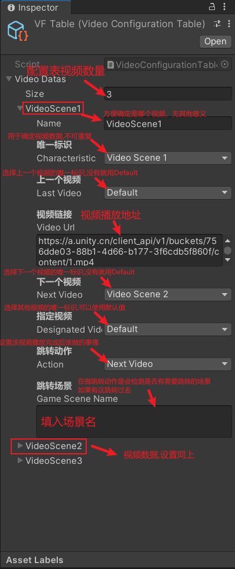

##1数据类
|唯一标识|上一个视频|视频url|下一个视频|指定跳转视频|跳转动作|跳转场景|
|---|---|---|---|---|---|---|
|characteristic|lastVideo|VideoUrl|nextVideo|designatedVideo|<div title="上一个·下一个·重复·跳转指定视频·结束播放·等待-跳转动作将在视频结束后执行&结束播放将直接关闭掉视频界面">action</div>|<div title="视频播放完成以后会去检测是否有跳转场景，如果有会在做跳转动作时去跳转场景">gameSceneName</div>|

##2视频配置表   
<u>Path:</u>`VideoMax/Resources/ScriptableObject/VFTable`  



##3接口功能
3.1:返回按钮(默认显示内置返回UI 添加回调不启动默认返回UI )提供隐藏接口  
	&emsp;3.1.1：自定义返回界面
``` c#
	//UseTheCustomComponent方法会通知点了击返回按钮在{}里面写显示逻辑
	VideoMax.Instance.SetVideoData(VideoCharacteristic.VideoScene3.GetVideoData()).UseTheCustomComponent(_=>{});
	//隐藏视频播放界面
	VideoMax.Instance.Hide();
```
3.2:提供倍速接口1-10(<font color=red>`微信小游戏video未提供修改视频速率的接口,所有微信小游戏暂时无法设置播放速率`</font>)
```c#
	//参数0.1f-10f速度可调
	VideoMax.Instance.SetPlaySpeed(2);

```
3.3:提供设置播放位置接口(只允许0-100%(传值0-1))
```c#
	//填入参数为百分比
	VideoMax.Instance.SetPlayLocation(0.5f);
```
3.4:提供触发跳转动作接口(不传跳转动作将使用数据类设定的跳转动作,传入跳转动作运行对应动作)  
	&emsp;3.4.1:<u>无需等待视频播放结束</u>,直接使用视频数据的动作并`立即执行`
```c#
	VideoMax.Instance.PreformAction();
```
	&emsp;3.4.2:<u>无需等待视频播放结束</u>,使用`VideoJumpAction.OverPlay`动作`并立即执行`
```c#
    VideoMax.Instance.PreformAction(VideoJumpAction.OverPlay);
```
3.5:提供重复进入视频选择是否重新播放(默认为重新播放,添加false则继续播放)  
	&emsp;3.5.1:`重新播放`
```c#
	VideoMax.Instance.SetVideoData(VideoCharacteristic.VideoScene1.GetVideoData());
```
	&emsp;3.5.2:`继续播放`
```c#
	VideoMax.Instance.SetVideoData(VideoCharacteristic.VideoScene1.GetVideoData(),false);
```
3.6:提供视频结束播放回调
```c#
	//指定播放的视频结束后会触发{}的代码
	VideoMax.Instance.SetVideoData(VideoCharacteristic.VideoScene1.GetVideoData()).VideoOver(()=>{});
```
3.7:提供隐藏UI接口(播放视频是需要把正在显示的UI隐藏,不然会遮住视频)
```c#
	//传入参数根据当前显示的UI来确定,隐藏控件VideoMax后会自动显示
	VideoMax.Instance.SetHideUI(gameObject,gameObject);
```